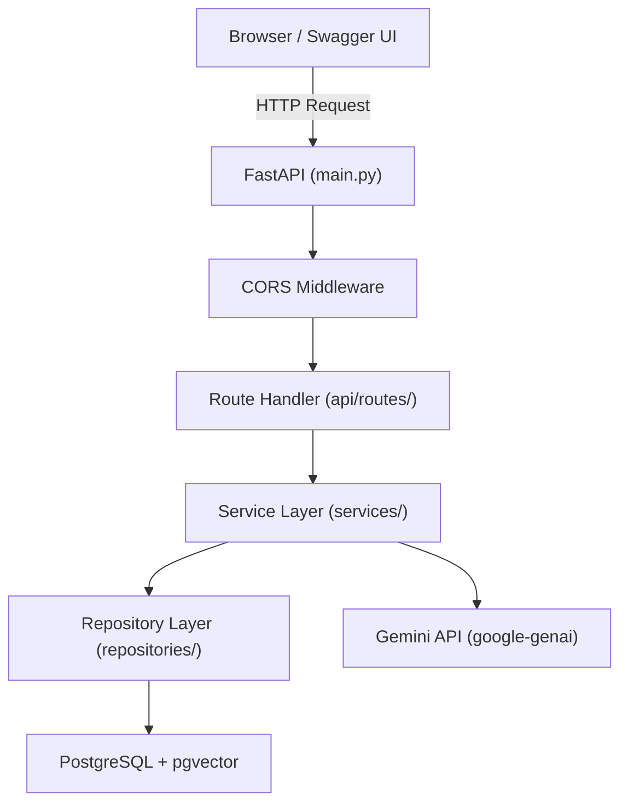

# Backend Architecture Walkthrough

This document explains the entire backend codebase — every folder, every file, and why it exists.

---

## The Big Picture



When a user uploads a document or asks a question, the request flows through **5 layers**, each with a single responsibility. This is the same layered architecture pattern you use in Go microservices.

---

## Project Structure

```
Simple_RAG/
├── app/                          # All backend Python code
│   ├── main.py                   # App entry point & factory
│   ├── api/                      # HTTP layer (routes)
│   │   ├── router.py             # Combines all route groups
│   │   └── routes/
│   │       ├── health.py         # GET /health
│   │       ├── documents.py      # POST/GET/DELETE /documents
│   │       ├── search.py         # POST /search
│   │       └── chat.py           # POST /chat
│   ├── core/                     # Cross-cutting infrastructure
│   │   ├── config.py             # Pydantic-settings (env vars)
│   │   ├── exceptions.py         # Custom error classes + handlers
│   │   └── logging.py            # Structured logging setup
│   ├── db/                       # Database infrastructure
│   │   ├── database.py           # SQLAlchemy engine, session factory
│   │   └── models.py             # ORM table definitions
│   ├── repositories/             # Data access layer (SQL queries)
│   │   └── document_repository.py
│   ├── schemas/                  # Pydantic request/response shapes
│   │   ├── document.py
│   │   ├── search.py
│   │   └── chat.py
│   └── services/                 # Business logic layer
│       ├── document_service.py   # Thin wrapper for route handlers
│       ├── ingestion_service.py  # Full upload pipeline orchestrator
│       ├── parser_service.py     # PDF/TXT text extraction
│       ├── chunking_service.py   # Text splitting into overlapping chunks
│       ├── embedding_service.py  # Gemini API vector generation
│       ├── llm_service.py        # Gemini API text generation
│       └── rag_service.py        # RAG orchestrator (search + generate)
├── data/                         # Test data & uploaded files
├── docs/                         # Phase-by-phase documentation
├── scripts/                      # Utility scripts (evaluate.py, verify_chunks.py)
├── tests/                        # Test files
├── .env                          # Local environment variables (never committed)
├── .env.example                  # Template for .env
├── docker-compose.yml            # PostgreSQL container config
└── pyproject.toml                # Python dependencies & project metadata
```

---

## Layer-by-Layer Explanation

### Layer 1: `app/main.py` — The Entry Point

**What it does:** Creates the FastAPI app, wires up middleware (CORS), registers all routes, and manages the application lifecycle (startup/shutdown).

**Key concepts:**
- **Application Factory Pattern:** The app is created inside `create_application()` rather than at module-level. This lets tests create a fresh app with test settings.
- **Lifespan context manager:** Code before `yield` runs on startup (connect to DB), code after `yield` runs on shutdown (close DB pool).
- **CORS Middleware:** Without this, browsers would block requests from `localhost:5173` (frontend) to `localhost:8000` (backend) because they are different "origins".

**Go analogy:** This is like your `func main()` in Go where you create the HTTP server, register routes, and call `log.Fatal(http.ListenAndServe(...))`.

---

### Layer 2: `app/api/routes/` — Route Handlers

**What they do:** Define the HTTP endpoints. Each file handles one "resource" (documents, search, chat, health).

**Key concepts:**
- Route handlers are intentionally **thin**. They parse the HTTP request, call a service, and return the response. No business logic lives here.
- `Depends()` is FastAPI's dependency injection. When a route declares `service: RAGService = Depends(get_rag_service)`, FastAPI automatically creates a new `RAGService` instance with a fresh DB session for every request, and cleans it up after.

**Go analogy:** These are your `http.HandlerFunc` functions.

---

### Layer 3: `app/schemas/` — Request & Response Shapes

**What they do:** Define the exact JSON shape of every API request and response using Pydantic models.

**Key concepts:**
- **Validation:** Pydantic validates incoming data automatically. If a user sends `{"question": ""}`, the `min_length=1` constraint in the schema will reject it with a 422 error before your code even runs.
- **Serialisation:** When your route returns a Pydantic model, FastAPI automatically converts it to JSON.
- **Schemas ≠ Models:** Schemas define the HTTP interface (what the outside world sees). Models define the database structure (what PostgreSQL stores). They look similar but serve different purposes.

**Go analogy:** These are your request/response structs with JSON tags.

---

### Layer 4: `app/services/` — Business Logic

**What they do:** Contain all the "thinking" — validation rules, orchestration of multi-step workflows, and integration with external APIs (Gemini).

| Service | Purpose |
|---|---|
| `ingestion_service.py` | Orchestrates the full upload pipeline: validate → hash → deduplicate → save → parse → chunk → embed → store |
| `parser_service.py` | Extracts raw text from PDFs (using PyMuPDF) and TXT files |
| `chunking_service.py` | Splits text into ~1000-char overlapping chunks |
| `embedding_service.py` | Calls Gemini API to convert text chunks into 768-dimension vectors |
| `llm_service.py` | Calls Gemini API to generate answers given context |
| `rag_service.py` | Orchestrates the RAG pipeline: embed query → search DB → generate answer |
| `document_service.py` | Thin wrapper that connects route handlers to the ingestion service |

---

### Layer 5: `app/repositories/` — Data Access

**What it does:** Contains ALL database queries. No SQL or ORM code exists anywhere else.

**Key concepts:**
- **Repository Pattern:** By isolating all DB access here, you can swap PostgreSQL for another database without touching any service or route code.
- `search_similar_chunks()` uses pgvector's `cosine_distance()` operator to find the most semantically similar chunks to a query vector.

---

### Layer 6: `app/db/` — Database Infrastructure

- **`database.py`:** Creates the SQLAlchemy async engine and session factory. The `get_db()` function is a generator that yields a session per request and auto-commits/rollbacks.
- **`models.py`:** Defines the actual PostgreSQL tables as Python classes (ORM). We have two tables:
  - `documents` — metadata about each uploaded file
  - `document_chunks` — the text chunks + their vector embeddings

---

### Layer 7: `app/core/` — Cross-Cutting Concerns

- **`config.py`:** Loads all settings from environment variables (or `.env` file) using pydantic-settings. Cached as a singleton via `@lru_cache`.
- **`exceptions.py`:** Custom exception classes (`ValidationError`, `ConflictError`, `ProcessingError`, `NotFoundError`) that map to HTTP status codes (400, 409, 500, 404).
- **`logging.py`:** Structured logging setup using Python's built-in `logging` module.

---

## The Two Core Flows

### Flow 1: Document Upload
```
User uploads PDF
    → POST /api/v1/documents
    → documents.py (route) reads bytes from multipart
    → IngestionService.ingest()
        → _validate_file() — check extension, size, magic bytes
        → hashlib.sha256() — compute content hash
        → repository.get_by_hash() — duplicate check
        → repository.create() — INSERT into documents table
        → _save_file() — write to disk (aiofiles)
        → _parse() — extract text via PyMuPDF
        → chunk_document() — split into ~1000 char pieces
        → embedding_service.get_embeddings() — call Gemini API
        → repository.create_chunks() — INSERT chunks + vectors
        → repository.update_status("ready")
    → Return DocumentResponse JSON
```

### Flow 2: Ask a Question (RAG)
```
User asks "Can I deploy on Friday?"
    → POST /api/v1/chat
    → chat.py (route) calls RAGService.chat()
        → EmbeddingService.get_embeddings(["Can I deploy on Friday?"])
            → Returns a 768-dim vector
        → repository.search_similar_chunks(vector, limit=5)
            → PostgreSQL pgvector cosine distance search
            → Returns top 5 most relevant chunks
        → LLMService.generate_answer(question, chunks)
            → Builds a prompt with the context chunks
            → Calls Gemini with temperature=0.0 (no creativity)
            → Returns grounded answer
    → Return ChatResponse JSON with answer + sources
```

---

## Key Libraries

| Library | Purpose | Go Equivalent |
|---|---|---|
| FastAPI | Web framework | net/http + chi/gin |
| SQLAlchemy | ORM + DB toolkit | sqlx / GORM |
| Pydantic | Validation & serialisation | validator structs |
| asyncpg | Async PostgreSQL driver | pgx |
| pgvector | Vector similarity search | — (no direct equivalent) |
| google-genai | Gemini API SDK | — |
| PyMuPDF | PDF text extraction | — |
| aiofiles | Async file I/O | os.WriteFile (but async) |
| pydantic-settings | Environment variable loading | envconfig / viper |
