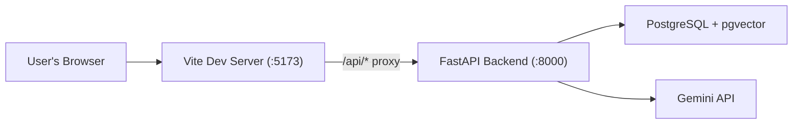

# Frontend Architecture Walkthrough

This document explains the entire frontend codebase — every file, every concept, and how it all connects to the backend you already understand.

---

## The Big Picture



The frontend is a **Single Page Application (SPA)** built with React. It runs entirely in the user's browser. When it needs data (documents, chat answers), it makes `fetch()` requests to our FastAPI backend. Vite's dev server proxies `/api/*` calls to `localhost:8000` so we don't deal with CORS during development.

---

## Project Structure

```
frontend/
├── index.html                    # The single HTML page (SPA entry)
├── package.json                  # Dependencies & scripts (like pyproject.toml)
├── vite.config.js                # Build tool config (like uvicorn settings)
└── src/                          # All source code
    ├── main.jsx                  # Mounts React into the HTML page
    ├── index.css                 # Global CSS design system
    ├── App.jsx                   # Root component (the page layout)
    ├── components/               # Reusable UI building blocks
    │   ├── DocumentUploader.jsx  # File upload + document list
    │   └── ChatInterface.jsx     # Chat messages + input box
    └── services/                 # Backend communication layer
        └── api.js                # All fetch() calls to FastAPI
```

**That's it. 7 files.** Intentionally minimal.

---

## File-by-File Explanation

### `index.html` — The Single HTML Page
Every SPA has exactly one HTML file. The browser loads this file, which contains a `<div id="root"></div>` and a `<script>` tag pointing to `main.jsx`. React then takes over and dynamically renders the entire UI inside that `<div>`.

**Key details:**
- We load the **Inter** font from Google Fonts for a clean, modern look.
- The `<meta name="description">` tag is for SEO.

---

### `package.json` — Dependencies
This is the JavaScript equivalent of your `pyproject.toml`. It declares what libraries the project needs and what scripts are available.

| Dependency | Purpose | Python Equivalent |
|---|---|---|
| `react` | UI component library | — (there's nothing like React in Python) |
| `react-dom` | Renders React to the browser DOM | — |
| `vite` | Build tool & dev server | `uvicorn` (serves files, hot-reloads) |
| `@vitejs/plugin-react` | Enables JSX syntax in Vite | — |

**Key commands:**
- `npm install` — Installs dependencies (like `pip install`)
- `npm run dev` — Starts the dev server on port 5173 (like `uvicorn --reload`)
- `npm run build` — Creates an optimised production bundle

---

### `vite.config.js` — Build Configuration
The most important thing here is the **proxy**:
```js
proxy: {
  '/api': {
    target: 'http://localhost:8000',
    changeOrigin: true,
  },
},
```
When the frontend makes a request to `/api/v1/chat`, Vite intercepts it and forwards it to `http://localhost:8000/api/v1/chat`. This means:
- The browser thinks it's talking to `localhost:5173` (same origin = no CORS)
- The request actually reaches FastAPI on port 8000
- **This only works in development.** In production (Vercel), we use `VITE_API_URL` environment variable instead.

---

### `src/main.jsx` — The Boot File
```jsx
ReactDOM.createRoot(document.getElementById('root')).render(
  <React.StrictMode>
    <App />
  </React.StrictMode>,
)
```
This is 3 lines that do one thing: find the `<div id="root">` in `index.html`, and render the `<App />` component inside it. Everything else flows from `App`.

---

### `src/index.css` — The Design System
This is the largest file and contains ALL the visual styling. We use **vanilla CSS with custom properties (CSS variables)** instead of a framework like Tailwind.

**Key design decisions:**
- **Dark Mode:** The `--bg-primary: #0f0f1a` creates a deep navy background
- **Glassmorphism:** `backdrop-filter: blur(12px)` on message bubbles creates a frosted glass effect
- **Accent Gradient:** `linear-gradient(135deg, #7c3aed, #a78bfa)` gives a violet-to-lavender gradient used on the logo, buttons, and user message bubbles
- **Micro-animations:** `@keyframes fadeInUp` makes messages slide in, `@keyframes bounce` creates the loading dots, `@keyframes pulse` animates the "processing" status

All colors, spacing, font sizes, and radii are defined as CSS variables (`:root { --bg-primary: ... }`). This means changing the entire theme requires editing only the variables at the top of the file.

---

### `src/services/api.js` — Backend Communication
This file contains three functions:

| Function | HTTP Call | What it does |
|---|---|---|
| `uploadDocument(file)` | `POST /api/v1/documents` | Sends a file as `multipart/form-data` |
| `fetchDocuments()` | `GET /api/v1/documents` | Gets the list of all uploaded docs |
| `sendChatMessage(question)` | `POST /api/v1/chat` | Sends a question, receives AI answer + sources |

All three use the native `fetch()` API (no external library like axios needed). Each function handles errors by checking `response.ok` and throwing descriptive error messages.

**Environment variable:** `VITE_API_URL` — In production, this will be set to your Render backend URL (e.g., `https://your-app.onrender.com`). Locally, it defaults to empty string `''`, which means "same origin" and the Vite proxy kicks in.

---

### `src/App.jsx` — The Layout
The simplest component. It creates a two-panel layout:
```
┌──────────────┬──────────────────────────┐
│   Sidebar    │                          │
│              │                          │
│  Logo        │     Chat Interface       │
│  Upload Zone │                          │
│  Doc List    │                          │
│              │                          │
└──────────────┴──────────────────────────┘
```
It imports `DocumentUploader` and `ChatInterface` and renders them side by side using CSS flexbox.

---

### `src/components/DocumentUploader.jsx` — Upload & List

**React concepts used:**
- **`useState`:** Creates reactive state variables (like Go variables that auto-update the UI when changed)
- **`useEffect`:** Runs code when the component first appears (like `init()` in Go)
- **`useRef`:** Creates a reference to a DOM element (the hidden `<input type="file">`)

**Flow:**
1. On mount, `useEffect` calls `fetchDocuments()` to load the document list from FastAPI.
2. When the user drags a file onto the upload zone (or clicks to browse), `handleFile()` is called.
3. `handleFile()` calls `uploadDocument(file)` from `api.js`, which sends the file to FastAPI.
4. On success, it reloads the document list and shows a toast notification.
5. Each document is rendered as a card showing filename, size, chunk count, and processing status.

---

### `src/components/ChatInterface.jsx` — The Chat Window

**React concepts used:**
- **`useState`** for `messages` (array of chat bubbles), `input` (text in the input box), `isLoading` (whether we're waiting for an AI response)
- **`useEffect`** to auto-scroll to the bottom when new messages appear
- **`useRef`** for the input element (to auto-focus after sending) and the scroll anchor

**Flow:**
1. When the chat is empty, a **Welcome Screen** is shown with suggestion chips.
2. When the user types a question and hits Enter (or clicks the send button):
   - The question is added to the `messages` array as a `user` message.
   - `isLoading` is set to `true`, which renders the animated loading dots.
   - `sendChatMessage(question)` calls `POST /api/v1/chat` on the backend.
   - The response (answer + sources) is added to `messages` as an `assistant` message.
3. Each assistant message renders its `sources` as small citation chips below the answer.

---

## How React Works (For Backend Engineers)

React is a **component-based** UI library. Here's the mental model:

| React Concept | Go/Backend Equivalent |
|---|---|
| **Component** | A function that returns HTML. Like a template function. |
| **Props** | Function arguments passed from parent to child. |
| **State (`useState`)** | A variable that, when changed, causes the function to re-run and the UI to update. |
| **Effect (`useEffect`)** | Code that runs after the component renders. Like a goroutine that starts on init. |
| **JSX** | HTML-like syntax inside JavaScript. `<div className="foo">` compiles to `React.createElement("div", ...)`. |

The key insight: **In React, the UI is a function of state.** You never manually update the DOM. You just change the state, and React re-renders the UI automatically. This is fundamentally different from jQuery-style "find the element and change its text".

---

## Running Locally

```bash
cd frontend
npm install        # Install dependencies (first time only)
npm run dev        # Start dev server on http://localhost:5173
```

Make sure your FastAPI backend is also running on port 8000 so the Vite proxy can forward API requests.
